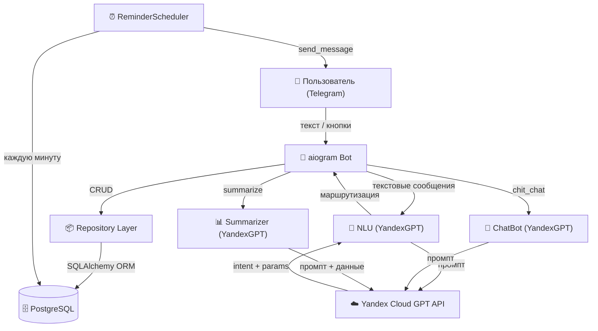
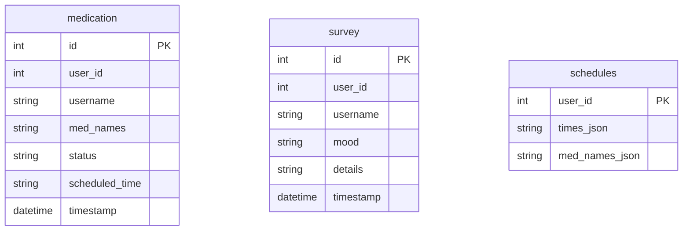

# Patient Monitor Bot — Документация проекта

## Описание проекта

**Patient Monitor Bot** — Telegram-бот для врачей и пациентов, позволяющий:

- настраивать напоминания о приёме таблеток;
- фиксировать факт приёма или пропуска лекарств;
- быстро или развёрнуто оценивать своё состояние;
- получать автоматический LLM-отчёт за последние 30 дней.

Пользователь взаимодействует через кнопки меню или свободным текстом — бот понимает оба варианта благодаря модулю NLU (Natural Language Understanding) на основе YandexGPT.

Ссылки:

[@psycho_support_program_bot](https://t.me/psycho_support_program_bot)

[DockerHub](https://hub.docker.com/r/sofyasalyaeva/patient-monitor-bot)

---

## Что видит пользователь

1. После `/start` — приветственное сообщение и меню из 6 кнопок.
2. Можно нажать кнопку или написать текстом, например: *«поставь напоминание выпить магний в 8 вечера»*.
3. Напоминания приходят автоматически в указанное время с кнопками ✅/❌.
4. Быстрый опрос — выбор настроения из 5 вариантов + опциональный текст.
5. Развёрнутый опрос — свободный текст любой длины.
6. Суммаризация — LLM генерирует аналитический отчёт по всем данным за 30 дней.

---

## Архитектура системы



---

## Схема базы данных (SQLite, файл data.db)



| Таблица | Назначение |
|---|---|
| `medication` | Лог каждого приёма / пропуска лекарств |
| `survey` | Записи опросов самочувствия |
| `schedules` | Текущее расписание напоминаний (1 строка на пользователя) |

---

## Паттерны и принципы

| Принцип / паттерн | Где применён |
|---|---|
| **DRY** | Клавиатуры — `keyboards.py`; states — `states.py`; LLM — один `LLMClient` |
| **Repository** | `MedicationRepo`, `SurveyRepo`, `ScheduleRepo` — всё через ORM |
| **Dependency Inversion** | Сервисы получают `LLMClient` через конструктор; тесты подставляют стабы |
| **Strategy (неявная)** | NLU, ChatBot, Summarizer — каждый формирует свой промпт, но вызывает один клиент |
| **Single Responsibility** | Каждый модуль ответственен за одну область |

---

## Секреты и безопасность

- Секреты (BOT_TOKEN, YANDEX_CLOUD_API_KEY) загружаются **только** из переменных окружения через `pydantic-settings`.
- `.env` добавлен в `.gitignore` — никогда не коммитится.
- В репо есть только `.env.example` с пустыми значениями.
- БД — локальный файл `data.db`, он тоже в `.gitignore`.
- Тесты подставляют фейковые значения через `conftest.py` — реальные секреты не нужны.

---

## Docker и развёртывание

```bash
# Сборка и старт
cp .env.example .env          # заполнить BOT_TOKEN и Yandex Cloud ключи
docker-compose up --build -d
```

- `docker-compose.yml` поднимает **только бот** — БД это файл `data.db` внутри Docker volume.
- Бот запускается как `python -m app.main` в slim-образе.
- Образ можно опубликовать на DockerHub: `docker tag patient-monitor-bot <user>/patient-monitor-bot && docker push`.

---

## Тестирование

```bash
pip install .[test]
python -m pytest --cov=app --cov-report=term-missing tests/
```

| Файл тестов | Что покрыт |
|---|---|
| `test_nlu.py` | NLUCache, парсинг JSON, fallback, кэш |
| `test_chatbot_summarizer.py` | ChatBot ответ + fallback, Summarizer отчёт + ошибка |
| `test_scheduler.py` | set/get/clear, отправка сообщений, повторная отправка, обработка ошибок |
| `test_handlers_utils.py` | `_parse_times`, `_format_schedule`, все клавиатуры |
| `test_repository.py` | CRUD для всех трёх таблиц (in-memory SQLite) |

Target coverage: **≥ 65 %** (настроен в `pyproject.toml`).

---

## План работ и оценка времени

| № | Задача | Время | Кто |
|---|---|---|---|
| 1 | Концепция и документация (эта схема) | 2 ч | Лид |
| 2 | DB models + session + repository | 3 ч | Лид |
| 3 | LLMClient + NLU | 2 ч | Лид |
| 4 | ChatBot + Summarizer | 1.5 ч | Лид |
| 5 | ReminderScheduler | 2 ч | Лид |
| 6 | Handlers (main + fallback) + keyboards | 3 ч | Лид |
| 7 | Тесты (все модули, coverage ≥ 65 %) | 4 ч | Лид |
| 8 | Dockerfile + docker-compose | 1.5 ч | Лид |
| 9 | .env / .gitignore / безопасность | 0.5 ч | Лид |
| 10 | Итоговый прогон тестов + деплой | 1 ч | Лид |
| | **Итого** | **~20.5 ч** | |
